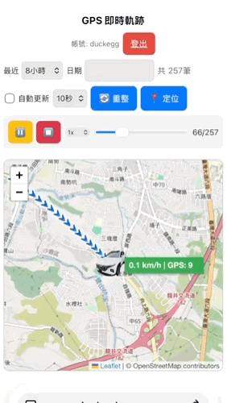

# GPS 即時軌跡系統

即時 GPS 位置監控與軌跡回放系統，具有安全的帳號認證與防暴力破解機制。



## 功能特性

- 🗺️ **即時地圖顯示**：Leaflet 地圖框架搭配 OpenStreetMap，即時顯示車輛位置與方向
- 📍 **軌跡回放**：支援播放歷史軌跡，可調整播放速度（0.5x - 20x），支援**循環播放**
- 🎨 **美化介面**：優化播放控制按鈕，提供更佳的視覺體驗與操作感
- 🔐 **安全認證**：支援資料庫帳號驗證、暴力破解防護、Session 防劫持
- 📊 **詳細資訊**：顯示時速、GPS 衛星數、方向角，自動計算軌跡距離
- ⚙️ **靈活查詢**：支援按時間範圍或日期查詢軌跡
- 🔄 **自動更新**：可設定自動刷新間隔（5-60 秒）
- 📈 **軌跡分析**：自動分割多段軌跡、異常點過濾、軌跡平滑化處理
- 🐳 **Docker 支援**：提供 Docker Compose 設定，一鍵啟動開發環境
- 💾 **Unix Socket 支援**：優先使用 Unix Socket 連接，支援 Synology MariaDB

## 快速開始

### 1. 使用 Docker 啟動 (推薦)

本專案提供 Docker 環境，包含 PHP 7.3 Apache 與 MariaDB：

```bash
# 啟動容器
docker-compose up -d
```

存取網址：`http://localhost:8082`

### 2. 環境設定

複製範本檔案並編輯設定：

```bash
cp .env.example.php .env.php
```

編輯 `.env.php`，系統會根據 `HTTP_HOST` 自動切換 Docker 或正式環境設定：

```php
// 資料庫設定
define('DB_HOST', 'db');
define('DB_USER', 'root');
define('DB_PASS', 'root');
define('DB_NAME', 'gps_view_db');
define('DB_TABLE', 'gpslog');

// 認證設定 (使用資料庫驗證)
define('AUTH_DB_TABLE', 'userinfo');
define('AUTH_DB_USER_COLUMN', 'id');
define('AUTH_DB_PASS_COLUMN', 'pass');
```

### 3. 資料庫準備

請確保資料庫中存在以下資料表：

- `gpslog`: 儲存軌跡點資料
- `userinfo`: 儲存使用者帳號密碼

### 4. 檔案權限

```bash
# 設定敏感檔案為唯讀（僅所有者可讀寫）
chmod 600 .env.php
chmod 755 generate_password_hash.php
```

## 檔案結構

```
gpsview/
├── index.php                  # 主應用程式（登入、地圖顯示、AJAX API）
├── docker-compose.yml         # Docker 容器定義
├── get-gps-to-db.php         # GPS 資料接收端點（含靜止過濾邏輯）
├── generate_password_hash.php # 密碼雜湊產生工具（備用）
├── .env.php                   # 設定檔（敏感，不提交）
├── .env.example.php           # 設定檔範本
├── SECURITY.md                # 安全說明文檔
├── README.md                  # 本檔案
├── tucsonl.png               # 車輛圖示
├── debug.php                  # 除錯工具
└── gps_view.php              # 舊版應用程式（已棄用）
```

## 使用說明

### 登入

存取網址後會看到登入畫面，輸入資料庫 `userinfo` 表中的帳號與密碼。

- **Session 逾時**：預設 1 小時後自動登出
- **暴力破解防護**：連續失敗 5 次將鎖定 15 分鐘

### 查詢軌跡

1. **按時間**：選擇「最近 2/4/6/8/12/16/24 小時」
2. **按日期**：輸入特定日期查詢該日軌跡
3. **播放控制**：點擊播放按鈕開始回放，結束後可再次點擊從頭播放。
4. **自動更新**：勾選「自動更新」並選擇刷新間隔（5-60 秒）

### 地圖交互

- **點擊軌跡線**：高亮該軌跡段並顯示詳細資訊
- **點擊軌跡上的點位**：顯示時間、時速、GPS 衛星數等詳細資訊
- **滑鼠移入軌跡**：軌跡高亮預覽
- **清除高亮**：點擊「✖ 清除」按鈕恢復原始狀態
- **縮放地圖**：調整地圖層級，車輛圖示大小動態配合
- **「定位到車輛」**：快速定位到最新位置

### 軌跡清單

- 當查詢結果包含多段軌跡時，「軌跡清單」按鈕可顯示所有軌跡
- 列表顯示軌跡時間範圍、距離、點位數和該段軌跡的距離(KM)
- 點擊軌跡清單項目可快速定位到該軌跡

## 安全性

### 帳號驗證

- 支援從資料庫 `userinfo` 表驗證帳號密碼
- 支援多組帳號管理
- 建議在生產環境中使用加密連線 (HTTPS)

### 暴力破解防護

- 失敗 5 次後鎖定帳號 15 分鐘
- 記錄客戶端 IP 追蹤異常登入
- 可在 `.env.php` 調整限制參數

### Session 安全

- HttpOnly Cookie 防止 JavaScript 盜取
- 支援 IP 位址變更檢查（防止 Session 劫持，可在代碼中啟用）
- SameSite=Lax 進行 CSRF 防護
- 自動逾時登出（預設 1 小時）

### 資料庫連線

- 支援 Unix Socket 連接（優先使用，避免反向代理影響）
- Socket 連接失敗時自動回退至 TCP 連接
- 支援 Synology MariaDB 環境

詳見 [SECURITY.md](SECURITY.md)

## 配置選項

編輯 `.env.php` 調整以下參數：

```php
// 登入限制
define('AUTH_MAX_ATTEMPTS', 5);           // 失敗次數
define('AUTH_LOCKOUT_MINUTES', 15);       // 鎖定時間

// Session
define('AUTH_SESSION_TIMEOUT', 3600);     // 逾時秒數（預設1小時）
define('AUTH_ENABLE_BRUTE_FORCE_PROTECTION', true);  // 啟用暴力破解防護

// 資料庫
define('DB_HOST', 'db');                  // Docker 環境使用 'db'
define('DB_USER', 'root');
define('DB_PASS', 'root');
define('DB_NAME', 'gps_view_db');
define('DB_TABLE', 'gpslog');

// 認證資料表
define('AUTH_DB_TABLE', 'userinfo');
define('AUTH_DB_USER_COLUMN', 'id');
define('AUTH_DB_PASS_COLUMN', 'pass');
```

## 資料表結構

### 1. GPS 軌跡表 `gpslog`

| 欄位名 | 型別 | 說明 |
|--------|------|------|
| dev_id | VARCHAR | 設備 ID |
| lat | DECIMAL | 緯度 |
| lng | DECIMAL | 經度 |
| log_tim | DATETIME | 記錄時間 |
| spd | DECIMAL | 時速 (km/h) |
| cog | DECIMAL | 方向角 (0-360°) |
| satcnt | INT | GPS 衛星數 |

```sql
CREATE TABLE gpslog (
  id INT AUTO_INCREMENT PRIMARY KEY,
  dev_id VARCHAR(50),
  lat DECIMAL(10,6),
  lng DECIMAL(10,6),
  log_tim DATETIME DEFAULT CURRENT_TIMESTAMP,
  spd DECIMAL(5,1),
  cog DECIMAL(5,1),
  satcnt INT,
  INDEX (log_tim),
  INDEX (dev_id, log_tim)
);
```

### 2. 使用者表 `userinfo`

| 欄位名 | 型別 | 說明 |
|--------|------|------|
| id | VARCHAR | 帳號 |
| pass | VARCHAR | 密碼 |

```sql
CREATE TABLE userinfo (
  id VARCHAR(50) PRIMARY KEY,
  pass VARCHAR(255) NOT NULL
);
```

## 故障排查

### 無法連線資料庫

1. 檢查 `.env.php` 中的資料庫設定
2. 確保資料庫伺服器可達
3. 驗證帳號密碼正確性

### 登入時被鎖定

帳號被鎖定 15 分鐘後可重試。調整參數：
```php
define('AUTH_LOCKOUT_MINUTES', 5);  // 減少鎖定時間
```

### 軌跡不顯示

1. 檢查資料庫中是否有 `gpslog` 表
2. 確認時間範圍內有資料
3. 查看瀏覽器開發者工具 (F12) 的 Network 標籤

## 開發與部署

### 使用 Docker 開發

```bash
# 啟動
docker-compose up -d

# 停止
docker-compose down
```

### 部署到生產環境

1. **複製檔案**：除 `.env.php` 外的所有檔案
2. **設定環境**：在伺服器上複製 `.env.example.php` 為 `.env.php` 並編輯
3. **設定權限**：
   ```bash
   chmod 600 .env.php
   ```
4. **啟用 HTTPS**：生產環境應使用 HTTPS 以確保 Session 安全

## 相關連結

- [安全說明文檔](SECURITY.md)
- [Leaflet 地圖框架文檔](https://leafletjs.com/)
- [OpenStreetMap 地圖服務](https://www.openstreetmap.org/)
- [Font Awesome 圖示庫](https://fontawesome.com/)

## 授權

本專案採用 MIT 授權。

## 支援與反饋

如有問題或建議，請通過以下方式聯絡：

- 檢視日誌：瀏覽器開發者工具 (F12)
- 伺服器日誌：檢視 PHP error.log

---

**最後更新**：2025 年 12 月
